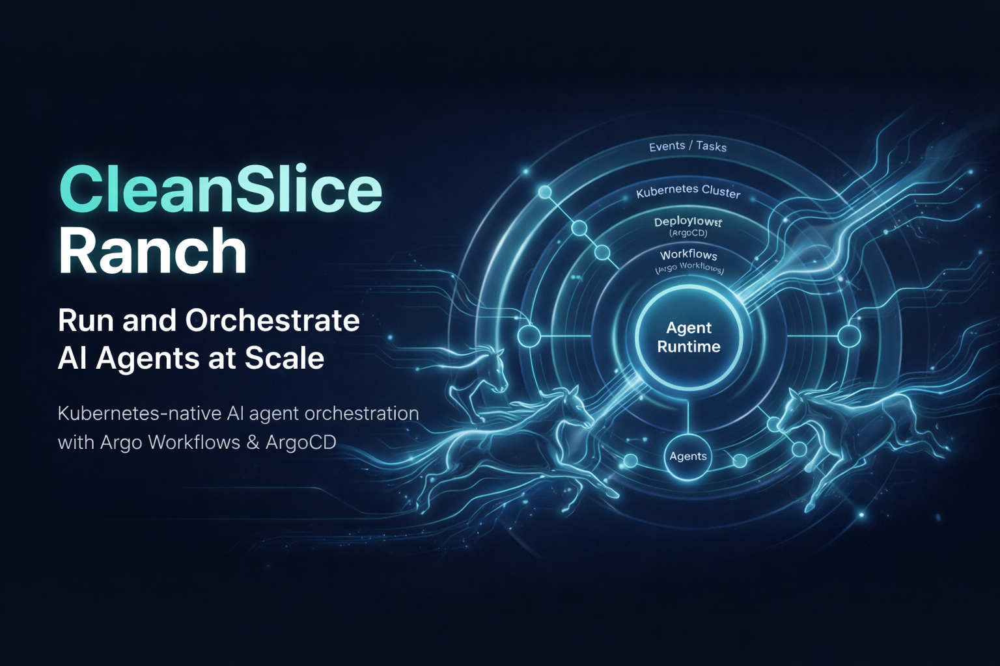

# Ranch

Agent deployment platform on Kubernetes. Deploy, manage, and monitor AI agents at scale.

Built with [CleanSlice](https://github.com/CleanSlice) architecture.

## Quick Start

```bash
git clone https://github.com/CleanSlice/ranch.git
cd ranch
make init
```

The setup wizard will guide you through:
1. Installing dependencies (Bun, Docker)
2. Setting up local PostgreSQL and running migrations
3. Optionally: configuring and deploying to Hetzner Cloud

After setup, start developing:

```bash
make dev    # Starts api:3000 + app:3001 + admin:3002
```

## Architecture

```
┌─────────────────────────────────────────────────────────┐
│                    Hetzner Cloud                        │
│                                                         │
│  ┌────────────┐  ┌────────────────┐  ┌───────────────┐  │
│  │  ArgoCD    │  │ Argo Workflows │  │  CloudNativePG│  │
│  │  (GitOps)  │  │ (Agent runs)   │  │  (PostgreSQL) │  │
│  └─────┬──────┘  └──────▲─────────┘  └───────────────┘  │
│        │ sync           │ submit                        │
│        ▼                │                               │
│  ┌──────────────────────┴──────────────────────────┐    │
│  │           Agent Manager (api)                   │    │
│  │  NestJS + Prisma + CleanSlice                   │    │
│  └─────────────────────────────────────────────────┘    │
│  ┌─────────────────┐  ┌─────────────────────────────┐   │
│  │  Dashboard (app)│  │   Admin Panel (admin)       │   │
│  │  Nuxt + Vue 3   │  │   Nuxt + Vue 3              │   │
│  └─────────────────┘  └─────────────────────────────┘   │
│                                                         │
│  ┌──────────────────────────────────────────────────┐   │
│  │  Agent Pods (dynamic, via Argo Workflows)        │   │
│  └──────────────────────────────────────────────────┘   │
└─────────────────────────────────────────────────────────┘
```

## Tech Stack

| Layer | Technology |
|---|---|
| Backend | NestJS, Prisma, PostgreSQL |
| Frontend | Nuxt 3, Vue 3, Pinia, Tailwind, shadcn-vue |
| Infrastructure | Terraform, Hetzner Cloud, k3s |
| Deployment | ArgoCD (GitOps), Argo Workflows |
| Runtime | Bun |
| Monorepo | Turborepo |

## Project Structure

```
ranch/
├── api/                  # NestJS backend
│   └── src/slices/
│       ├── setup/        #   prisma, health, error
│       ├── agent/        #   CRUD + deploy agents
│       ├── workflow/     #   Argo Workflows integration
│       ├── template/     #   Agent templates
│       └── log/          #   Agent logs
├── app/                  # Nuxt user dashboard
│   └── slices/
│       ├── setup/        #   pinia, i18n, theme, api, error
│       ├── agent/        #   Agent list, detail, create
│       ├── template/     #   Browse templates
│       └── common/       #   Layout, navigation
├── admin/                # Nuxt admin panel
│   └── slices/
│       ├── setup/        #   pinia, i18n, theme, api, error
│       ├── agent/        #   Manage all agents
│       ├── template/     #   CRUD templates
│       ├── user/         #   User management
│       ├── setting/      #   System settings
│       └── common/       #   Admin layout
├── terraform/            # Hetzner infrastructure
│   ├── modules/          #   cluster, network, bootstrap, dns, database
│   └── environments/     #   dev, prod (+ your custom env)
├── k8s/                  # Kubernetes manifests
│   ├── argocd/           #   App-of-apps
│   ├── infrastructure/   #   Argo Workflows, CNPG, database
│   ├── platform/         #   api, app, admin deployments
│   └── templates/        #   Argo WorkflowTemplate for agents
└── .github/workflows/    # CI/CD
```

## Prerequisites

- [Bun](https://bun.sh/) — `curl -fsSL https://bun.sh/install | bash`
- [Docker](https://docs.docker.com/get-docker/) — for local PostgreSQL
- [Terraform](https://developer.hashicorp.com/terraform/install) — for infrastructure
- [kubectl](https://kubernetes.io/docs/tasks/tools/) — for cluster management
- [Helm](https://helm.sh/docs/intro/install/) — for chart management

## Local Development

### Quick Start

```bash
make setup    # Install deps, start DB, run migrations
make dev      # Start api + app + admin
```

### All Commands

```bash
make help             # Show all commands

# Development
make setup            # Full local setup (first time)
make dev              # Start all services (api:3000, app:3001, admin:3002)
make dev-api          # Start API only
make dev-app          # Start app only
make dev-admin        # Start admin only

# Database
make db               # Start PostgreSQL via Docker
make db-stop          # Stop PostgreSQL
make db-reset         # Reset database (destroy data)
make migrate          # Generate schema + run migrations
make generate         # Regenerate schema.prisma from slices
make studio           # Open Prisma Studio

# Build & Test
make build            # Build all services
make lint             # Lint all services
make test             # Run tests
make clean            # Remove node_modules and build artifacts
```

### API Endpoints

After `make dev`, the API is available at `http://localhost:3000`:

- `GET /health` — Health check
- `GET /api` — Swagger UI
- `POST /agents` — Create and deploy an agent
- `GET /agents` — List all agents
- `GET /agents/:id` — Get agent details
- `PUT /agents/:id` — Update agent config
- `POST /agents/:id/restart` — Restart agent
- `DELETE /agents/:id` — Stop and delete agent
- `GET /agents/:agentId/logs` — Get agent logs
- `GET /templates` — List agent templates
- `POST /templates` — Create template
- `PUT /templates/:id` — Update template
- `DELETE /templates/:id` — Delete template

## Prisma Schema (per-slice)

Each slice defines its own `.prisma` file at the slice root. They are merged into `prisma/schema.prisma` by `prisma-import` at build time.

```
api/src/slices/
├── setup/prisma/prisma.prisma    # datasource + generator
├── agent/agent.prisma            # Agent model
└── template/template.prisma      # Template model
```

Edit the slice `.prisma` files, then:

```bash
make generate   # Merge into prisma/schema.prisma
make migrate    # Create migration + generate client
```

## Deploy to Hetzner Cloud

### 1. Create Your Environment

```bash
# Copy the dev template
cp -r terraform/environments/dev terraform/environments/myenv

# Edit variables
vi terraform/environments/myenv/terraform.tfvars.example
# Copy and fill in your values:
cp terraform/environments/myenv/terraform.tfvars.example terraform/environments/myenv/terraform.tfvars
```

Required variables in `terraform.tfvars`:

```hcl
hcloud_token        = "your-hetzner-api-token"
domain              = "ranch.yourdomain.com"
admin_ip            = "YOUR_IP/32"          # curl ifconfig.me
ssh_public_key_path = "~/.ssh/id_ed25519.pub"
```

### 2. Create MicroOS Snapshots (first time only)

The k3s cluster requires MicroOS snapshots on Hetzner:

```bash
brew install packer   # if not installed

# Download and build snapshots
cd /tmp
curl -sLO https://raw.githubusercontent.com/kube-hetzner/terraform-hcloud-kube-hetzner/master/packer-template/hcloud-microos-snapshots.pkr.hcl
packer init hcloud-microos-snapshots.pkr.hcl
HCLOUD_TOKEN="your-token" packer build hcloud-microos-snapshots.pkr.hcl
```

### 3. Provision Infrastructure

```bash
make infra-init ENV=myenv    # Download providers
make infra-plan ENV=myenv    # Preview changes
make infra-apply ENV=myenv   # Create cluster (~5-10 min)
```

This creates:
- k3s cluster with Traefik ingress and cert-manager
- VPC + Firewall
- Load Balancer

### 4. Get Kubeconfig

```bash
make kubeconfig ENV=myenv
export KUBECONFIG=~/.kube/ranch-myenv
kubectl get nodes
```

### 5. Install Platform Services

```bash
# Add Helm repos
helm repo add argo https://argoproj.github.io/argo-helm
helm repo add cnpg https://cloudnative-pg.github.io/charts
helm repo update

# Install ArgoCD
helm install argocd argo/argo-cd \
  --namespace argocd --create-namespace \
  --set server.ingress.enabled=true \
  --set server.ingress.ingressClassName=traefik \
  --set "server.ingress.hosts[0]=argocd.ranch.yourdomain.com"

# Install Argo Workflows
helm install argo-workflows argo/argo-workflows \
  --namespace argo --create-namespace

# Install CloudNativePG
helm install cnpg cnpg/cloudnative-pg \
  --namespace cnpg-system --create-namespace

# Create namespaces
kubectl create namespace platform
kubectl create namespace agents

# Apply workflow templates
kubectl apply -f k8s/templates/agent-workflow.yaml
```

### 6. Configure DNS

Add A records at your DNS provider pointing to the Load Balancer IP:

```
api.ranch.yourdomain.com      A  → <LB_IP>
app.ranch.yourdomain.com      A  → <LB_IP>
admin.ranch.yourdomain.com    A  → <LB_IP>
argocd.ranch.yourdomain.com   A  → <LB_IP>
```

Get the LB IP:

```bash
kubectl get svc -n traefik traefik -o jsonpath='{.status.loadBalancer.ingress[0].ip}'
```

### 7. Connect ArgoCD to Repository

```bash
# Get ArgoCD password
make argocd-password

# Login to ArgoCD UI at https://argocd.ranch.yourdomain.com
# Username: admin
# Password: <output from above>

# Deploy app-of-apps
make deploy
```

### 8. Create Secrets

```bash
make k8s-secrets   # Interactive — will ask for DATABASE_URL
```

## Forking for Your Organization

Ranch is designed to be forked per-organization:

```bash
# 1. Fork CleanSlice/ranch → YourOrg/ranch

# 2. Clone your fork
git clone git@github.com:YourOrg/ranch.git
cd ranch

# 3. Add upstream
git remote add upstream git@github.com:CleanSlice/ranch.git

# 4. Create your environment
cp -r terraform/environments/dev terraform/environments/yourenv

# 5. Customize k8s manifests
# - k8s/argocd/app-of-apps.yaml → change repoURL to YourOrg/ranch
# - k8s/platform/*/ingress.yaml → change hostnames
# - k8s/platform/*/deployment.yaml → change image registry
# - Makefile → change ENV default

# 6. Sync upstream changes
git fetch upstream
git merge upstream/main
git push origin main
```

## Cluster Management

```bash
make k8s-status       # Show nodes, pods, ArgoCD apps
make k8s-logs-api     # Tail API logs
make argocd-password  # Get ArgoCD admin password
make infra-destroy ENV=myenv   # Tear down infrastructure
```

## GitOps Flow

```
git push → GitHub Actions:
  ├── CI (lint + test)
  ├── Build Docker images → ghcr.io
  └── ArgoCD detects new image
        └── Syncs to cluster (zero-downtime rolling update)
```

ArgoCD manages:
- **Infrastructure** — Argo Workflows, CloudNativePG, PostgreSQL cluster
- **Platform** — API, App, Admin deployments
- **Templates** — Argo WorkflowTemplates for agent pods

## License

Private — CleanSlice
